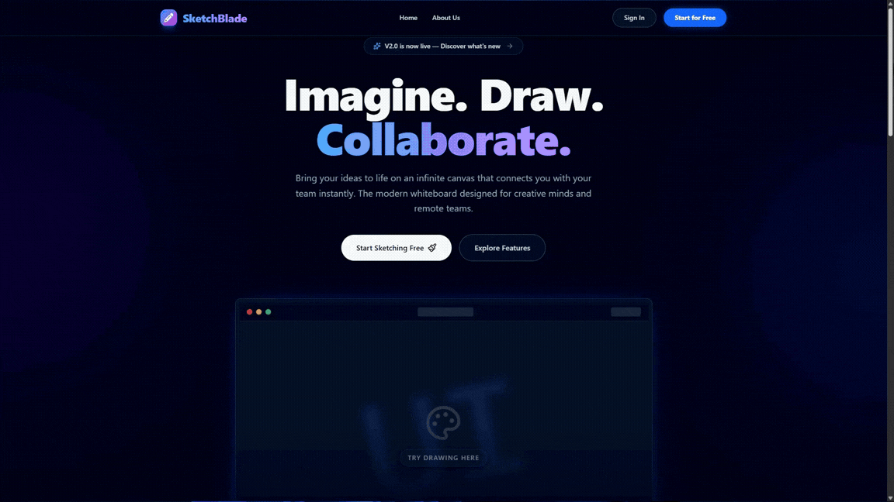

# SketchBlade

A real-time collaborative whiteboard built on an infinite canvas. Multiple people can work on the same drawing at once — every stroke, shape, and cursor position is synced live over websockets.

Live demo: [sketch-blade.vercel.app](https://sketch-blade.vercel.app/)



## Why I built this

Most whiteboard tools either lock collaboration behind a paywall or feel sluggish when more than a couple of people join. I wanted to see how far I could push a fully self-hostable alternative: tldraw for the canvas, Socket.io for the sync layer, and a dashboard on top for organizing work into folders. SketchBlade is the result — and a good reference if you're curious how tldraw's sync protocol works over a custom transport.

## Features

- **Infinite canvas** — powered by tldraw, with shapes, arrows, and freehand drawing
- **Live collaboration** — cursors and edits sync in real time via Socket.io, using tldraw's sync protocol under the hood
- **Dashboard** — organize drawings into folders, sort and filter them, and mark favorites
- **Authentication** — handled by Clerk, including webhook-based user sync on the backend
- **Dark mode first** — the UI was designed dark from the start, with motion kept subtle on purpose

## Tech stack

| Layer      | Tools                                                            |
| ---------- | ---------------------------------------------------------------- |
| Frontend   | React 19, Vite, TypeScript, Tailwind CSS 4, Redux Toolkit, tldraw |
| Backend    | Node.js, Express 5, TypeScript, Socket.io, Mongoose              |
| Database   | MongoDB 8                                                        |
| Auth       | Clerk (React SDK on the front, Clerk SDK + webhooks on the back)  |
| Infra      | Docker Compose, ngrok (for Clerk webhooks in local dev)           |

## Project structure

```
sketch_blade/
├── apps/
│   ├── web/     # React frontend (Vite)
│   └── api/     # Express backend + Socket.io server
├── assets/      # Demo assets
├── compose.yml  # Docker Compose for local development
└── .env.example
```

Both apps are pnpm workspaces in spirit — pnpm is enforced via a `preinstall` check, so don't use npm or yarn.

## Getting started

The easiest way to run everything locally is Docker Compose. It brings up four services: the frontend, the API, MongoDB, and an ngrok tunnel that Clerk webhooks can reach.

### Prerequisites

- [Docker](https://www.docker.com/products/docker-desktop/) (Docker Compose v2 works with the built-in `docker compose` command)
- A [Clerk](https://clerk.com/) account for auth keys
- An [ngrok](https://ngrok.com/) auth token

### Setup

1. **Clone and configure**

   ```bash
   git clone https://github.com/abdurrab-khan/sketch_blade.git
   cd sketch_blade
   cp .env.example .env
   ```

2. **Fill in `.env`** — the variables that actually matter:

   | Variable | What it's for |
   | --- | --- |
   | `MONGO_INITDB_ROOT_USERNAME` / `MONGO_INITDB_ROOT_PASSWORD` | Mongo credentials; the `MONGO_URI` in the example already matches them |
   | `CLERK_PUBLIC_KEY` / `CLERK_SECRET_KEY` / `CLERK_SIGNING_SECRET` | From your Clerk dashboard |
   | `VITE_CLERK_PUBLIC_KEY` | The publishable key, for the frontend |
   | `VITE_TLDRAW_LICENSE_KEY` | Optional — only needed if you use tldraw's watermark-free license features |
   | `NGROK_AUTHTOKEN` | Your ngrok token, used for the Clerk webhook tunnel |

   Note the compose file hard-fails at startup if the Mongo or ngrok variables are missing, so don't skip them.

3. **Start everything**

   ```bash
   docker compose up --build
   ```

   Add `-d` if you'd rather run it detached. Both apps have file-watching set up through Compose's `develop.watch`, so source changes sync into the containers without a rebuild.

4. **Open the app**

   Frontend: <http://localhost:5173>
   API: <http://localhost:8080>
   ngrok inspector: <http://localhost:4040>

One gotcha worth knowing: the Clerk webhook URL points at a fixed ngrok domain (`aware-wanted-puma.ngrok-free.app` in `compose.yml`). If you're running this yourself, update that domain to your own and point your Clerk webhook settings at it.

### Running without Docker

Both apps run fine on their own if you'd rather not use containers. You'll need Node 22+ and pnpm:

```bash
# backend
cd apps/api
pnpm install
pnpm dev

# frontend (second terminal)
cd apps/web
pnpm install
pnpm dev
```

You'll still need a MongoDB instance somewhere reachable — either a local install or something like MongoDB Atlas — and the right `MONGO_URI`.

## Scripts

| Command | Runs in | What it does |
| --- | --- | --- |
| `pnpm dev` | `apps/api`, `apps/web` | Start the dev server (nodemon / Vite) |
| `pnpm build` | `apps/api`, `apps/web` | Type-check and build for production |
| `pnpm test` | `apps/api`, `apps/web` | Run the Jest test suite |
| `pnpm test:coverage` | `apps/api`, `apps/web` | Same, with a coverage report |
| `pnpm lint` | `apps/web` | ESLint |
| `pnpm format` | `apps/api` | Prettier |

## Contributing

Issues and PRs are welcome. If you're planning something bigger than a typo fix, open an issue first so we can talk it through — saves everyone a wasted afternoon. Please run `pnpm lint` and the test suite before submitting.

## License

ISC © [Abdur Rab Khan](https://github.com/abdurrab-khan)

